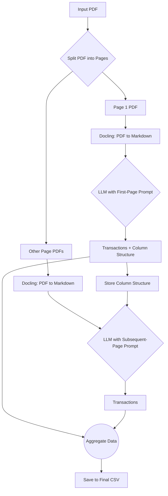

# 🏦 Bank Statement Extractor using Local LLMs

A powerful, local-first bank statement extraction tool that uses [Docling](https://github.com/docling-io/docling) for high-accuracy document parsing and local Large Language Models (via Ollama) to intelligently extract and structure transaction data from PDF files.

This project streamlines the process of converting messy PDF bank statements into a clean, structured CSV file, ready for analysis. It works by analyzing the first page to understand the table layout and then applies that structure to the rest of the document.

## 🚀 Features

- **📄 Page-by-Page Processing**: Splits multi-page PDFs to handle large documents efficiently.
- **🔬 High-Accuracy Parsing**: Leverages Docling's `TableFormer` model to precisely convert PDF tables into a Markdown format.
- **🧠 Intelligent Extraction**: Uses a local LLM to identify the transaction table structure on the first page and extract data.
- **🤖 Dynamic Prompting**: The table structure learned from the first page is used to create specific prompts for subsequent pages, ensuring consistency.
- **🔒 Privacy-Focused**: Runs entirely on your local machine. Your financial data is never sent to a third-party cloud service.
- **✅ Single CSV Output**: Aggregates all transactions from all pages into one clean CSV file.

## 📋 Prerequisites

Before you begin, ensure you have the following installed:

1.  **Python 3.8+**
2.  **Ollama**: You need a running Ollama instance with a model.
    - [Download Ollama](https://ollama.com/)
    - Pull a model to use for extraction. We recommend a smaller, instruction-tuned model for speed.
      ```bash
      ollama pull llama3:8b-instruct
      ```

## ⚡ Quick Start

1.  **Navigate to the project directory:**
    If you have cloned this project, `cd` into the directory.

2.  **Install the required Python packages:**
    ```bash
    pip install -r requirements.txt
    ```

3.  **Run the extraction pipeline:**
    Make sure your Ollama application is running. Then, execute the script with your PDF file.

    ```bash
    python final.py "path/to/your/bank_statement.pdf"
    ```

    The script will create a CSV file named `bank_statement_final_data.csv` in the same directory.

## 🔧 Usage and Options

You can specify a different Ollama model using the `--model` flag.

```bash
# Use a different model
python final.py "path/to/your/statement.pdf" --model "phi3:instruct"

# Use a larger model (may be slower but potentially more accurate)
python final.py "path/to/your/statement.pdf" --model "llama3:70b-instruct"
```

### Command-Line Arguments
- `input_pdf` (Required): The path to the input PDF file.
- `--model` (Optional): The name of the Ollama model to use. Defaults to `llama3:8b-instruct`.

## ⚙️ How It Works

The extraction process follows these steps:

1.  **PDF Splitting**: The input PDF is split into individual pages in a temporary directory.
2.  **Page 1 Analysis**:
    - The first page PDF is converted to Markdown using **Docling**. This preserves the table structure.
    - A special prompt is sent to the LLM, asking it to extract transactions **and** identify the table's column structure (e.g., column names, order, and data types).
3.  **Subsequent Page Processing**:
    - For every other page, the PDF is also converted to Markdown.
    - A new, dynamic prompt is generated that includes the column structure learned from page 1. This tells the LLM exactly how to map the table columns to the desired JSON fields.
    - The LLM extracts the transactions based on this structure.
4.  **Data Aggregation**: All extracted transactions from all pages are collected.
5.  **CSV Generation**: The final list of transactions is converted into a Pandas DataFrame and saved as a single CSV file. A `transaction_id` is added for convenience.

This two-step approach (analyze-then-extract) makes the process robust, as it doesn't rely on finding headers on every single page.

## 📁 Output

The script generates two main outputs:

1.  **A CSV File**: A file named `{your_pdf_name}_final_data.csv` containing all the extracted transactions. The columns are ordered logically, with any custom fields discovered in the statement appended at the end.

    | transaction_id | date       | description        | debit   | credit  | running_balance | reference |
    |----------------|------------|--------------------|---------|---------|-----------------|-----------|
    | 1              | 2024-01-01 | SALARY CREDIT      |         | 50000.00| 75000.00        | SAL001    |
    | 2              | 2024-01-02 | ATM WITHDRAWAL 1234| 5000.00 |         | 70000.00        | ATM123    |

2.  **Debug Logs (`debug_logs/` directory)**: For troubleshooting, the script saves the intermediate files in this directory.
    - `page_{n}_markdown.txt`: The Markdown content generated by Docling for each page.
    - `page_{n}_llm_output.json`: The raw JSON output from the LLM for each page.
    - `extracted_column_structure.json`: The column structure detected from the first page.

## 🏗️ Architecture



## 🎨 Advanced Features

### Custom Table Detection
```python
from intelligent_page_parser import AdvancedPDFParser

parser = AdvancedPDFParser(
    preserve_layout=True,
    use_ocr=True,
    table_extraction_methods=['camelot', 'pdfplumber']
)

pages = parser.parse_pdf_comprehensive('statement.pdf', 'output')
```

### Processing Specific Page Ranges
```python
# Process only specific pages (implementation can be extended)
parser.parse_pages_range('statement.pdf', 'output', pages=[1, 2, 3])
```

## 🔬 Technical Details

### Parsing Methods Comparison

| Method | Speed | Accuracy | Layout | Tables | Best For |
|--------|-------|----------|--------|--------|----------|
| Unstructured | ⭐⭐⭐ | ⭐⭐⭐⭐ | ⭐⭐⭐ | ⭐⭐⭐⭐ | General documents |
| PDFPlumber | ⭐⭐⭐⭐ | ⭐⭐⭐⭐⭐ | ⭐⭐⭐⭐⭐ | ⭐⭐⭐⭐ | Layout preservation |
| PyMuPDF | ⭐⭐⭐⭐⭐ | ⭐⭐⭐ | ⭐⭐⭐ | ⭐⭐ | Fast processing |
| Camelot | ⭐⭐ | ⭐⭐⭐⭐⭐ | ⭐⭐ | ⭐⭐⭐⭐⭐ | Structured tables |
| Tabula | ⭐⭐⭐ | ⭐⭐⭐⭐ | ⭐⭐ | ⭐⭐⭐⭐ | Stream tables |

### Performance Optimization
- Parallel processing where possible
- Smart caching of intermediate results
- Memory-efficient handling of large documents
- Progressive quality fallbacks

## 🐛 Troubleshooting

### Common Issues

**Tesseract not found**:
```bash
# macOS
brew install tesseract

# Ubuntu
sudo apt-get install tesseract-ocr

# Windows
# Download from: https://github.com/UB-Mannheim/tesseract/wiki
```

**Poor table extraction**:
- Try different table extraction methods
- Check if PDF has selectable text vs. scanned images
- Adjust confidence thresholds

**Low confidence scores**:
- Enable OCR for scanned documents
- Check PDF quality and resolution
- Verify the document isn't password protected

## 🤝 Contributing

1. Fork the repository
2. Create a feature branch
3. Make your changes
4. Add tests for new functionality
5. Submit a pull request

## 📄 License

This project is licensed under the MIT License - see the LICENSE file for details.

## 🙏 Acknowledgments

- [Unstructured](https://unstructured.io/) for document processing
- [PDFPlumber](https://github.com/jsvine/pdfplumber) for layout analysis
- [Camelot](https://camelot-py.readthedocs.io/) for table extraction
- [PyMuPDF](https://pymupdf.readthedocs.io/) for PDF processing
- [Tesseract](https://github.com/tesseract-ocr/tesseract) for OCR capabilities

---

**Made with ❤️ for accurate bank statement processing** 