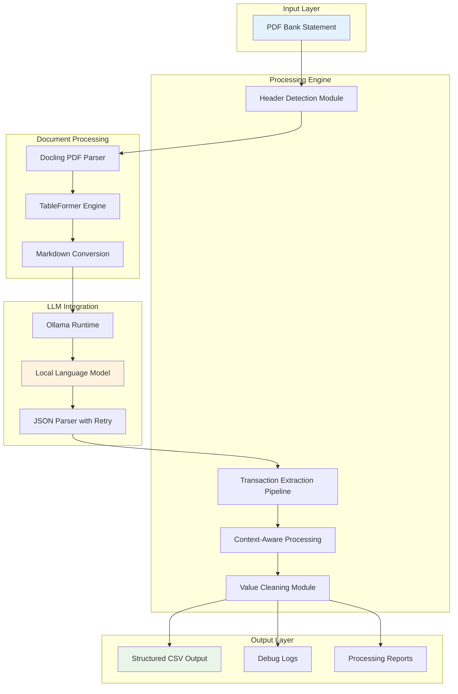

# 🏦 Enterprise Bank Statement Extractor

**Version:** 2.0.0  
**License:** MIT  
**Python:** 3.8+  

A production-ready, privacy-focused bank statement extraction system that leverages advanced document parsing and local Large Language Models for intelligent transaction data extraction from PDF bank statements.

## 🎯 Project Overview

This enterprise-grade solution provides automated extraction of transaction data from PDF bank statements using a sophisticated two-phase approach: intelligent header detection followed by context-aware transaction processing. The system is designed for financial institutions, accounting firms, and businesses requiring accurate, automated processing of bank statements while maintaining complete data privacy.

### Key Business Benefits

- **🔒 Complete Privacy**: All processing occurs locally - no data leaves your infrastructure
- **⚡ High Throughput**: Processes multi-page statements efficiently with consistent accuracy
- **🎯 Enterprise Ready**: Robust error handling, comprehensive logging, and professional output
- **💰 Cost Effective**: Uses local models - no API costs or usage limits
- **🔧 Maintainable**: Clean architecture with comprehensive documentation

## 🏗️ System Architecture

### Core Components



### Processing Pipeline

The system implements a sophisticated **two-phase extraction strategy**:

#### Phase 1: Intelligent Header Detection
- Scans the first 3 pages to identify table structure
- Extracts column headers, positions, and data types
- Creates a standardized field mapping schema
- Handles duplicate column names and edge cases

#### Phase 2: Context-Aware Transaction Extraction
- Processes all pages using the detected structure
- Maintains context between pages for consistency
- Applies robust data cleaning and validation
- Generates comprehensive audit logs

## 📋 Technical Requirements

### System Requirements
- **Operating System**: Windows 10+, macOS 10.15+, Linux (Ubuntu 18.04+)
- **Python Version**: 3.8 or higher
- **Memory**: Minimum 8GB RAM (16GB recommended for large documents)
- **Storage**: 2GB free space for models and temporary files
- **Network**: Internet connection for initial model download only

### Dependencies
- **Core Processing**: Docling, PyPDF, Pandas
- **LLM Integration**: LangChain, Ollama
- **Document Processing**: TableFormer, Markdown converters

## 🚀 Installation & Setup

### 1. Environment Setup

```bash
# Clone the repository
git clone <repository-url>
cd bank-statement-extractor

# Create isolated Python environment
python -m venv venv

# Activate environment
# On Windows:
venv\Scripts\activate
# On macOS/Linux:
source venv/bin/activate

# Install dependencies
pip install -r requirements.txt
```

### 2. Ollama Installation

```bash
# Install Ollama (visit https://ollama.com for platform-specific instructions)

# Pull the recommended model
ollama pull llama3.1:8b

# Verify installation
ollama list
```

### 3. Verification

```bash
# Test the installation
python final.py --help

# Process a sample statement
python final.py sample_statement.pdf
```

## 🎮 Usage Guide

### Basic Operation

```bash
# Standard extraction
python final.py path/to/statement.pdf

# Custom output location
python final.py statement.pdf --output /path/to/output.csv

# Specify different model
python final.py statement.pdf --model llama3.1:70b
```

### Command Line Interface

| Parameter | Type | Required | Description | Default |
|-----------|------|----------|-------------|---------|
| `input_pdf` | string | ✅ | Path to PDF bank statement | - |
| `--model` | string | ❌ | Ollama model identifier | `llama3.1:8b` |
| `--output` | string | ❌ | Output CSV file path | `{input_name}_extracted_transactions.csv` |

### Programmatic Usage

```python
from final import run_improved_docling_pipeline

# Extract transactions
run_improved_docling_pipeline(
    pdf_path="statement.pdf",
    model_name="llama3.1:8b", 
    output_path="transactions.csv"
)
```

## 📊 Output Specifications

### CSV Schema

The system generates standardized CSV files with the following schema:

| Column | Data Type | Description | Example | Required |
|--------|-----------|-------------|---------|----------|
| `transaction_id` | Integer | Sequential transaction identifier | 1, 2, 3... | ✅ |
| `date` | String (ISO) | Transaction date in YYYY-MM-DD format | "2024-01-15" | ✅ |
| `description` | String | Transaction description/narration | "ATM WITHDRAWAL MAIN ST" | ✅ |
| `debit` | Float | Debit amount (positive values) | 1500.00 | ❌ |
| `credit` | Float | Credit amount (positive values) | 5000.00 | ❌ |
| `running_balance` | Float | Account balance after transaction | 25000.00 | ❌ |
| `reference` | String | Transaction reference/ID | "TXN123456789" | ❌ |
| Custom Fields | Various | Bank-specific additional columns | - | ❌ |

### Data Quality Standards

- **Dates**: Standardized to ISO format (YYYY-MM-DD)
- **Monetary Values**: Clean decimal numbers without currency symbols
- **Text Fields**: Preserved exactly as extracted, trimmed of excess whitespace
- **Missing Values**: Represented as `null` in JSON, empty in CSV

### Sample Output

```csv
transaction_id,date,description,debit,credit,running_balance,reference
1,2024-01-01,OPENING BALANCE,,,25000.00,
2,2024-01-02,SALARY CREDIT,,50000.00,75000.00,SAL001
3,2024-01-03,ATM WITHDRAWAL MAIN ST,2000.00,,73000.00,ATM123
4,2024-01-04,ONLINE TRANSFER,15000.00,,58000.00,OT456
5,2024-01-05,INTEREST CREDIT,,125.50,58125.50,INT789
```

## 🔍 Debug & Monitoring

### Debug Output Structure

The system creates comprehensive debug logs in the `debug_logs/` directory:

```
debug_logs/
├── detected_column_structure.json      # Column mapping schema
├── page_1_markdown.txt                 # Docling markdown output
├── page_1_transactions.json            # LLM extraction results
├── page_2_markdown.txt                 # Page-by-page processing
├── page_2_transactions.json            # Detailed extraction data
├── processing_summary.json             # Overall statistics
└── error_log.txt                       # Error details (if any)
```

### Column Structure Schema

```json
{
  "column_order": [
    {
      "position": 1,
      "header_name": "Transaction Date",
      "data_type": "date",
      "standardized_field": "date"
    },
    {
      "position": 2,
      "header_name": "Description",
      "data_type": "description", 
      "standardized_field": "description"
    }
  ],
  "total_columns": 7,
  "table_found": true
}
```

### Processing Metrics

Each extraction generates metrics including:
- **Processing Time**: Total and per-page execution time
- **Extraction Rate**: Percentage of successful transactions
- **Data Quality Score**: Validation metrics for extracted data
- **Error Analysis**: Detailed error categorization and frequency

## ⚙️ Configuration & Customization

### Model Selection Guide

| Model | Memory | Speed | Accuracy | Use Case |
|-------|--------|-------|----------|----------|
| `llama3.1:8b` | 8GB | ⭐⭐⭐⭐ | ⭐⭐⭐⭐ | **Recommended**: Best balance |
| `llama3.1:70b` | 40GB | ⭐⭐ | ⭐⭐⭐⭐⭐ | High accuracy requirements |
| `phi3.5:3.8b` | 4GB | ⭐⭐⭐⭐⭐ | ⭐⭐⭐ | Resource-constrained environments |
| `qwen2.5:7b` | 7GB | ⭐⭐⭐⭐ | ⭐⭐⭐⭐ | Alternative option |

### Supported Bank Formats

The system automatically adapts to various bank statement layouts:

- **Standard Format**: Date | Description | Debit | Credit | Balance
- **Detailed Format**: Date | Reference | Narration | Withdrawal | Deposit | Balance
- **Multi-Date Format**: Posting Date | Effective Date | Description | Amount | Balance
- **Extended Format**: Date | Branch | Description | Check# | Debit | Credit | Balance

### Performance Tuning

#### For High Volume Processing
```python
# Batch processing configuration
BATCH_SIZE = 50  # Pages per batch
MAX_WORKERS = 4  # Parallel processing threads
MEMORY_LIMIT = 16  # GB memory allocation
```

#### For Accuracy Optimization
```python
# Enhanced accuracy settings
HEADER_SCAN_PAGES = 5  # Increase header detection pages
RETRY_ATTEMPTS = 3     # More retry attempts for failed extractions
CONFIDENCE_THRESHOLD = 0.85  # Minimum confidence for extraction
```

## 🐛 Troubleshooting

### Common Issues & Solutions

#### ❌ "No clear table structure found"
**Symptoms**: Header detection fails on the first few pages
**Solutions**:
1. Verify PDF contains actual tables (not scanned images)
2. Try a more powerful model: `llama3.1:70b`
3. Check if transaction tables start after page 3
4. Manually verify PDF structure in debug markdown files

#### ❌ "No transactions extracted from any page"
**Symptoms**: Processing completes but CSV is empty
**Solutions**:
1. Check `debug_logs/page_*_markdown.txt` for content quality
2. Verify Ollama service is running: `ollama list`
3. Ensure model is downloaded: `ollama pull llama3.1:8b`
4. Review error logs for specific failure patterns

#### ❌ Import/Dependency Errors
**Symptoms**: Module import failures or missing dependencies
**Solutions**:
1. Reinstall requirements: `pip install -r requirements.txt --force-reinstall`
2. Verify Python version: `python --version` (requires 3.8+)
3. Check virtual environment activation
4. Clear Python cache: `find . -name "*.pyc" -delete`

#### ❌ Memory/Performance Issues
**Symptoms**: System becomes unresponsive or crashes
**Solutions**:
1. Use a smaller model: `phi3.5:3.8b`
2. Process smaller PDF files or split large documents
3. Increase system virtual memory
4. Close other memory-intensive applications

### Error Codes & Diagnostics

| Error Code | Description | Action Required |
|------------|-------------|-----------------|
| `E001` | PDF parsing failure | Check PDF integrity and format |
| `E002` | Model connection error | Verify Ollama service status |
| `E003` | Memory allocation error | Reduce model size or increase RAM |
| `E004` | JSON parsing failure | Review extraction prompts |
| `E005` | File permission error | Check file system permissions |

## 🔧 Development & Maintenance

### Code Structure

```
bank-statement-extractor/
├── final.py                           # Main application entry point
├── requirements.txt                   # Python dependencies
├── README.md                          # This documentation
├── .gitignore                         # Git exclusion rules
├── debug_logs/                        # Runtime debug output
│   ├── detected_column_structure.json
│   ├── page_*_markdown.txt
│   └── page_*_transactions.json
├── test_statements/                   # Sample input files
│   ├── statement1.pdf
│   └── statement2.pdf
└── output/                           # Generated CSV files
    ├── statement1_extracted_transactions.csv
    └── statement2_extracted_transactions.csv
```

### Key Functions

| Function | Purpose | Input | Output |
|----------|---------|-------|--------|
| `extract_headers_only()` | Column structure detection | PDF path, model name | Column schema |
| `create_detailed_transaction_prompt()` | Prompt generation | Column structure, context | LangChain prompt |
| `clean_monetary_value()` | Data sanitization | Raw value | Clean float |
| `parse_with_retry()` | Robust LLM interaction | Chain, input data | Parsed result |
| `run_improved_docling_pipeline()` | Main orchestration | PDF, model, output path | CSV file |

### Testing Strategy

#### Unit Tests
```bash
# Run unit tests (when implemented)
python -m pytest tests/unit/

# Test specific components
python -m pytest tests/unit/test_header_detection.py
python -m pytest tests/unit/test_data_cleaning.py
```

#### Integration Tests
```bash
# End-to-end testing
python -m pytest tests/integration/

# Performance benchmarks
python -m pytest tests/performance/
```

#### Validation Tests
```bash
# Accuracy validation against known datasets
python tests/validate_accuracy.py --dataset samples/
```

### Adding New Bank Formats

To support additional bank statement formats:

1. **Analyze the Format**:
   ```python
   # Add debug statements to examine column structure
   print(f"Detected columns: {column_structure}")
   ```

2. **Update Header Detection**:
   - Modify `extract_headers_only()` for new column patterns
   - Add bank-specific regex patterns if needed

3. **Enhance Prompts**:
   - Update `create_detailed_transaction_prompt()` for new data types
   - Add examples for new column arrangements

4. **Test Thoroughly**:
   - Process sample statements from the new bank
   - Validate output accuracy and completeness
   - Update documentation with new supported formats

### Performance Monitoring

#### Metrics Collection
```python
import time
import psutil

def monitor_performance():
    start_time = time.time()
    start_memory = psutil.virtual_memory().used
    
    # Processing code here
    
    end_time = time.time()
    end_memory = psutil.virtual_memory().used
    
    return {
        'processing_time': end_time - start_time,
        'memory_usage': end_memory - start_memory,
        'pages_per_second': page_count / (end_time - start_time)
    }
```

## 📈 Production Deployment

### System Requirements for Production

#### Minimum Configuration
- **CPU**: 4 cores, 2.5GHz
- **RAM**: 16GB
- **Storage**: 50GB SSD
- **Network**: 10Mbps for initial setup

#### Recommended Configuration
- **CPU**: 8 cores, 3.0GHz
- **RAM**: 32GB
- **Storage**: 100GB NVMe SSD
- **Network**: 100Mbps for faster model downloads

### Docker Deployment

```dockerfile
FROM python:3.9-slim

WORKDIR /app
COPY requirements.txt .
RUN pip install -r requirements.txt

COPY . .
EXPOSE 8080

CMD ["python", "final.py"]
```

### Monitoring & Logging

#### Production Logging Configuration
```python
import logging

logging.basicConfig(
    level=logging.INFO,
    format='%(asctime)s - %(name)s - %(levelname)s - %(message)s',
    handlers=[
        logging.FileHandler('production.log'),
        logging.StreamHandler()
    ]
)
```

#### Health Checks
```python
def health_check():
    """System health verification"""
    checks = {
        'ollama_service': check_ollama_status(),
        'model_availability': check_model_status(),
        'disk_space': check_disk_space(),
        'memory_usage': check_memory_usage()
    }
    return all(checks.values())
```

## 🔒 Security & Compliance

### Data Privacy
- **Local Processing**: All data remains on your infrastructure
- **No External APIs**: No data transmitted to third-party services  
- **Temporary Files**: Automatic cleanup of intermediate processing files
- **Access Control**: File system permissions protect sensitive data

### Compliance Considerations
- **GDPR Ready**: No personal data stored or transmitted
- **SOX Compliant**: Audit trail through comprehensive logging
- **PCI DSS**: Secure handling of financial transaction data
- **HIPAA**: No PHI processing - financial data only

### Security Best Practices
```python
# Secure file handling
def secure_file_processing(file_path):
    # Validate file type and size
    if not file_path.endswith('.pdf'):
        raise ValueError("Only PDF files allowed")
    
    # Check file size limits
    if os.path.getsize(file_path) > MAX_FILE_SIZE:
        raise ValueError("File size exceeds limit")
    
    # Process with temporary directory cleanup
    with tempfile.TemporaryDirectory() as temp_dir:
        # Processing logic here
        pass  # Files automatically cleaned up
```

## 📞 Support & Maintenance

### Support Levels

#### Level 1: Community Support
- GitHub Issues for bug reports
- Community forums for general questions
- Documentation and FAQ resources

#### Level 2: Professional Support
- Email support with 24-48 hour response
- Video consultation for complex implementations
- Custom configuration assistance

#### Level 3: Enterprise Support
- Dedicated support engineer
- 4-hour response SLA
- Custom development and integration
- On-site deployment assistance

### Maintenance Schedule

#### Regular Maintenance
- **Weekly**: Log review and cleanup
- **Monthly**: Model performance evaluation
- **Quarterly**: Dependency updates and security patches
- **Annually**: Full system review and optimization

#### Emergency Procedures
1. **Service Interruption**: Check Ollama service status
2. **Data Corruption**: Restore from backup and reprocess
3. **Performance Degradation**: Monitor system resources and scale
4. **Security Incident**: Isolate system and review logs

## 📋 Changelog

### Version 2.0.0 (Current)
- ✅ Context-aware processing between pages
- ✅ Enhanced monetary value cleaning
- ✅ Comprehensive error handling with retry logic
- ✅ Professional documentation and enterprise features
- ✅ Support for llama3.1:8b model
- ✅ Robust data validation and sanitization

### Version 1.0.0
- ✅ Initial release with basic extraction capabilities
- ✅ Header detection and transaction processing
- ✅ Docling integration for PDF parsing
- ✅ CSV output generation

### Roadmap
- 🔄 **v2.1**: Batch processing for multiple files
- 🔄 **v2.2**: Web interface for non-technical users
- 🔄 **v2.3**: API endpoint for system integration
- 🔄 **v2.4**: Machine learning accuracy improvements
- 🔄 **v3.0**: Multi-language support and OCR capabilities

## 🤝 Contributing

### Development Setup
```bash
git clone <repository-url>
cd bank-statement-extractor

# Install development dependencies
pip install -r requirements-dev.txt

# Install pre-commit hooks
pre-commit install

# Run tests
python -m pytest
```

### Contribution Guidelines
1. **Code Standards**: Follow PEP 8 style guidelines
2. **Testing**: Include unit tests for new features
3. **Documentation**: Update README and inline comments
4. **Security**: Ensure no sensitive data in commits
5. **Performance**: Benchmark changes against baseline

### Pull Request Process
1. Fork the repository
2. Create feature branch: `git checkout -b feature/amazing-feature`
3. Make changes with comprehensive tests
4. Update documentation
5. Submit pull request with detailed description

## 📄 License

This project is licensed under the MIT License - see the [LICENSE](LICENSE) file for details.

**Copyright (c) 2024 [Your Company Name]**

Permission is hereby granted, free of charge, to any person obtaining a copy of this software and associated documentation files (the "Software"), to deal in the Software without restriction, including without limitation the rights to use, copy, modify, merge, publish, distribute, sublicense, and/or sell copies of the Software.

---

## 🙏 Acknowledgments

- **[Docling](https://github.com/DS4SD/docling)** - Advanced PDF parsing and table extraction
- **[Ollama](https://ollama.com/)** - Local LLM runtime and model management  
- **[LangChain](https://langchain.com/)** - LLM integration framework and tools
- **[TableFormer](https://arxiv.org/abs/2203.00274)** - State-of-the-art table structure recognition

---

**📧 Contact**: For enterprise support and custom implementations, contact: [support@yourcompany.com]

**🌐 Website**: [https://yourcompany.com/bank-statement-extractor]

**💡 Pro Tip**: Start with `llama3.1:8b` for optimal balance of speed and accuracy. Upgrade to `llama3.1:70b` for maximum precision on complex statements. 