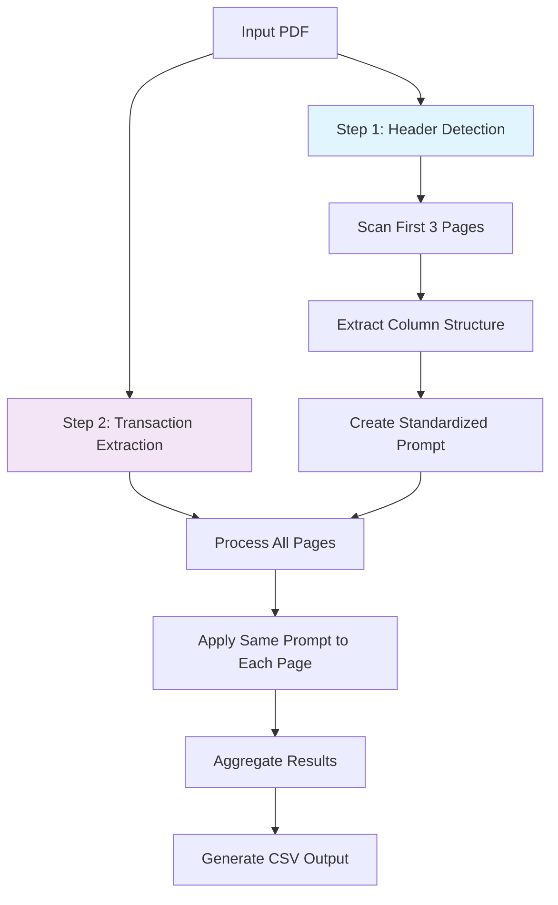

# 🏦 Bank Statement Extractor

A powerful, privacy-focused bank statement extraction tool that uses **Docling** for high-accuracy document parsing and **local Large Language Models** (via Ollama) to intelligently extract and structure transaction data from PDF bank statements.

## ✨ Key Features

- **🧠 Intelligent Header Detection**: Automatically analyzes the first few pages to understand table structure and column layout
- **📄 Consistent Processing**: Uses the detected structure to process all pages with standardized prompts
- **🔒 100% Local & Private**: Runs entirely on your machine - your financial data never leaves your computer
- **🎯 High Accuracy**: Leverages Docling's TableFormer model for precise PDF table extraction
- **📊 Clean Output**: Produces a single, structured CSV file with all transactions
- **🔍 Debug-Friendly**: Saves intermediate files for troubleshooting and verification

## 🛠️ How It Works

The extraction process uses a **two-step approach**:

1. **Header Detection Phase**: Scans the first few pages to identify column structure, headers, and data types
2. **Transaction Extraction Phase**: Processes all pages using the detected structure for consistent results



## 📋 Prerequisites

1. **Python 3.8+**
2. **Ollama** with a compatible model:
   ```bash
   # Install Ollama from https://ollama.com/
   # Pull a recommended model
   ollama pull llama3:8b-instruct
   ```

## 🚀 Quick Start

1. **Install dependencies:**
   ```bash
   pip install -r requirements.txt
   ```

2. **Run the extractor:**
   ```bash
   python final.py path/to/your/statement.pdf
   ```

3. **Check the output:**
   - CSV file: `{filename}_extracted_transactions.csv`
   - Debug logs: `debug_logs/` directory

## 💾 Installation

### Using pip (Recommended)
```bash
# Clone the repository
git clone <repository-url>
cd bank-statement-extractor

# Install dependencies
pip install -r requirements.txt
```

### Using virtual environment
```bash
# Create virtual environment
python -m venv venv
source venv/bin/activate  # On Windows: venv\Scripts\activate

# Install dependencies
pip install -r requirements.txt
```

## 🎮 Usage

### Basic Usage
```bash
python final.py statement.pdf
```

### Advanced Options
```bash
# Specify custom model
python final.py statement.pdf --model llama3:70b-instruct

# Custom output path
python final.py statement.pdf --output my_transactions.csv

# Help
python final.py --help
```

### Command-Line Arguments
| Argument | Required | Description | Default |
|----------|----------|-------------|---------|
| `input_pdf` | ✅ | Path to the PDF bank statement | - |
| `--model` | ❌ | Ollama model name | `llama3:8b-instruct` |
| `--output` | ❌ | Output CSV file path | `{input}_extracted_transactions.csv` |

## 📈 Output Format

The tool generates a clean CSV file with standardized columns:

| Column | Description | Example |
|--------|-------------|---------|
| `transaction_id` | Unique identifier | 1, 2, 3... |
| `date` | Transaction date (YYYY-MM-DD) | 2024-01-15 |
| `description` | Transaction description | "ATM WITHDRAWAL" |
| `debit` | Debit amount (positive numbers) | 1500.00 |
| `credit` | Credit amount (positive numbers) | 5000.00 |
| `running_balance` | Account balance after transaction | 25000.00 |
| `reference` | Reference number or code | "TXN123456" |

### Sample Output
```csv
transaction_id,date,description,debit,credit,running_balance,reference
1,2024-01-01,OPENING BALANCE,,,25000.00,
2,2024-01-02,SALARY CREDIT,,50000.00,75000.00,SAL001
3,2024-01-03,ATM WITHDRAWAL,2000.00,,73000.00,ATM123
```

## 🔍 Debug Information

The tool creates a `debug_logs/` directory with helpful files:

```
debug_logs/
├── detected_column_structure.json    # Column mapping detected from headers
├── page_1_markdown.txt               # Docling's markdown output for each page
├── page_1_transactions.json          # LLM's JSON response for each page
├── page_2_markdown.txt
├── page_2_transactions.json
└── ...
```

## ⚙️ Configuration

### Supported Bank Statement Formats

The tool automatically detects various column layouts:

- **Date + Description + Debit + Credit + Balance**
- **Date + Particulars + Withdrawal + Deposit + Balance**
- **Date + Narration + Amount + Balance + Reference**
- And many other variations...

### Model Recommendations

| Model | Speed | Accuracy | Memory | Best For |
|-------|-------|----------|--------|----------|
| `llama3:8b-instruct` | ⭐⭐⭐⭐ | ⭐⭐⭐⭐ | 8GB | Balanced performance |
| `phi3:instruct` | ⭐⭐⭐⭐⭐ | ⭐⭐⭐ | 4GB | Fast processing |
| `llama3:70b-instruct` | ⭐⭐ | ⭐⭐⭐⭐⭐ | 40GB | Maximum accuracy |

## 🐛 Troubleshooting

### Common Issues

**❌ "No clear table structure found"**
- Ensure the PDF contains actual tables (not just text)
- Try a more powerful model like `llama3:70b-instruct`
- Check if the first few pages contain the transaction table

**❌ "No transactions extracted"**
- Verify the PDF contains transaction data
- Check the `debug_logs/` for markdown output quality
- Ensure Ollama is running: `ollama list`

**❌ "Model not found"**
- Pull the model: `ollama pull llama3:8b-instruct`
- Check available models: `ollama list`

**❌ Import errors**
- Install requirements: `pip install -r requirements.txt`
- Check Python version: `python --version` (needs 3.8+)

### Performance Tips

- **For speed**: Use `phi3:instruct` model
- **For accuracy**: Use `llama3:70b-instruct` model  
- **For balance**: Use default `llama3:8b-instruct` model
- **Large PDFs**: Process in smaller batches if memory issues occur

## 🏗️ Architecture

### Core Components

1. **Header Extraction (`extract_headers_only`)**
   - Scans first 3 pages for table structure
   - Uses Docling for PDF → Markdown conversion
   - Employs LLM to identify column mapping

2. **Transaction Processing (`create_detailed_transaction_prompt`)**
   - Creates standardized prompts based on detected structure
   - Processes all pages with consistent mapping
   - Handles multi-row transactions and edge cases

3. **Pipeline Orchestration (`run_improved_docling_pipeline`)**
   - Coordinates the entire extraction process
   - Manages temporary files and cleanup
   - Aggregates results into final CSV

### Technology Stack

- **PDF Processing**: [Docling](https://github.com/DS4SD/docling) with TableFormer
- **LLM Integration**: [LangChain](https://langchain.com/) + [Ollama](https://ollama.com/)
- **Data Processing**: [Pandas](https://pandas.pydata.org/)
- **PDF Manipulation**: [PyPDF](https://pypdf.readthedocs.io/)

## 🤝 Contributing

1. Fork the repository
2. Create a feature branch: `git checkout -b feature/amazing-feature`
3. Make your changes
4. Run tests (if available)
5. Commit: `git commit -m 'Add amazing feature'`
6. Push: `git push origin feature/amazing-feature`
7. Open a Pull Request

## 📝 License

This project is licensed under the MIT License - see the [LICENSE](LICENSE) file for details.

## 🙏 Acknowledgments

- **[Docling](https://github.com/DS4SD/docling)** - For excellent PDF table extraction
- **[Ollama](https://ollama.com/)** - For local LLM capabilities
- **[LangChain](https://langchain.com/)** - For LLM integration framework

---

**💡 Pro Tip**: Start with the default `llama3:8b-instruct` model. If you need better accuracy, upgrade to `llama3:70b-instruct`. If you need speed, try `phi3:instruct`. 